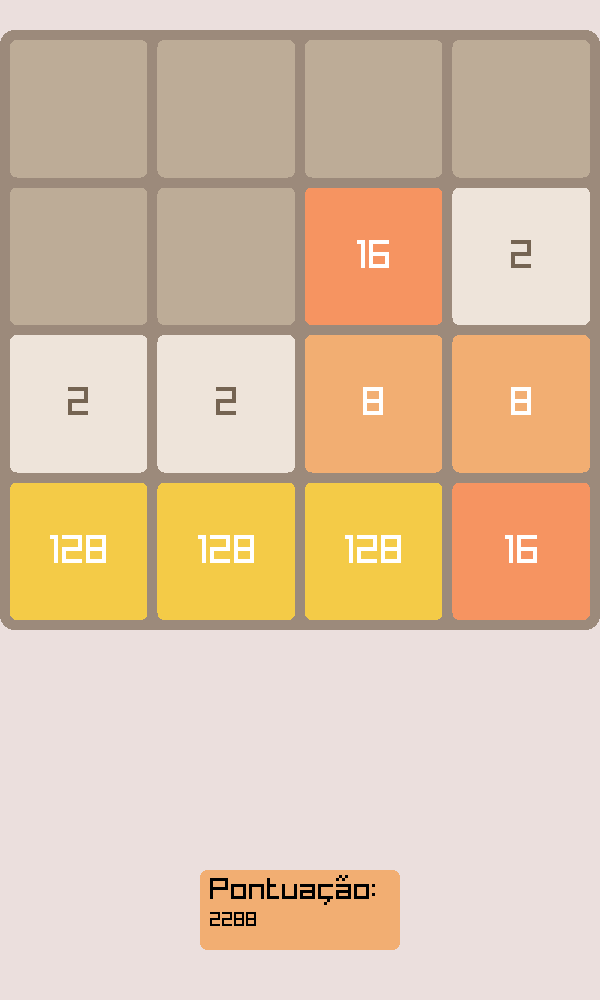
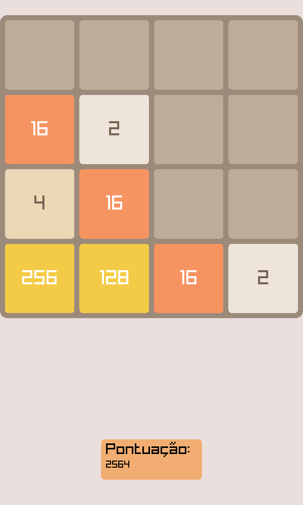
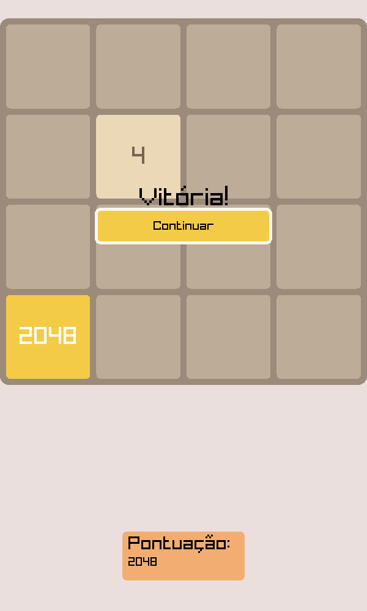

# 2048 - Implementação em C usando Raylib
Uma implementação do clássico jogo 2048 desenvolvida em C com interface gráfica.

Fiz essa implementação no começo da disciplina de Programação Imperativa, antes de
dominar conceitos mais relativamente avançados, como **structs** e **ponteiros**. Mesmo
assim, fico feliz com o resultado que obti em termos de otimização e evolução na jornada
de programador. O projeto em si focou em dominar a manipulação de matrizes, e encontrar
soluções inteligentes para os diversos problemas que foram aparecendo.

### 🎮 Controles: 
/A/S/D: Mover o tabuleiro

## Screenshots:

